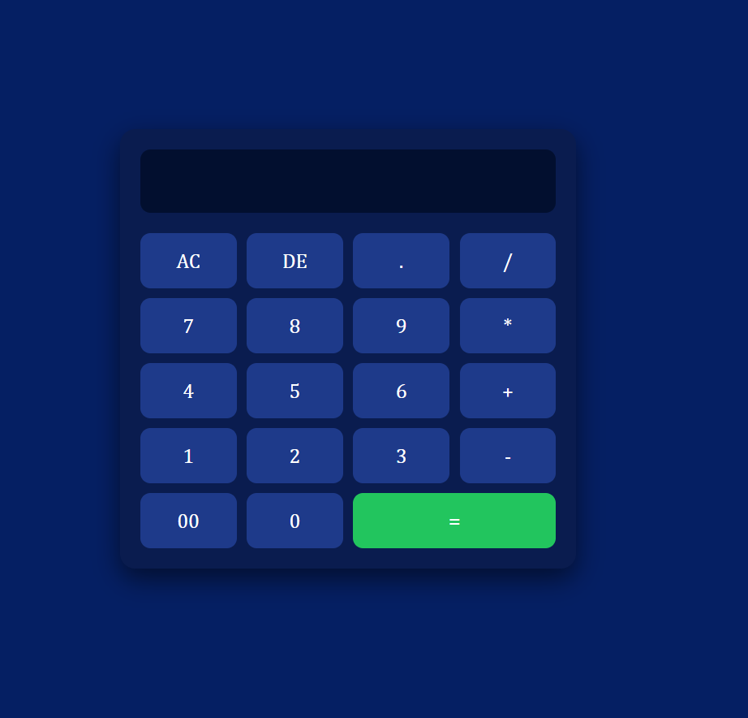

# 🧮 Simple Calculator

A responsive calculator built with **HTML, CSS, and JavaScript**.  
This project was created as a practice exercise to understand DOM manipulation, event handling, and basic UI design.

---

## 🚀 Features

- Perform basic arithmetic operations: `+`, `-`, `*`, `/`
- Clear input with **AC**
- Delete last character with **DE**
- Responsive design with modern UI
- Error handling for invalid expressions

## 🚀 Live Demo

[Click here to try it out](https://Jayboy2003.github.io/calculator-app/)

## 🛠️ Built With

- **HTML** – Structure of the calculator
- **CSS** – Styling and layout (Grid + custom design)
- **JavaScript** – Functionality and logic

---

## 📸 Screenshot

---

## 📂 Project Structure

const display = document.getElementById("display");
const buttons = document.querySelectorAll("input[type=button]");

buttons.forEach((button) => {
button.addEventListener("click", (e) => {
let value = button.value;

    if (value === "AC") {
      display.value = "";
    } else if (value === "DE") {
      // Delete last character
      display.value = display.value.slice(0, -1);
    } else if (value === "=") {
      // Calculate result safely
      try {
        display.value = eval(display.value);
      } catch {
        display.value = "Error";
      }
    } else {
      // Append button value
      display.value += value;
    }

});
});
